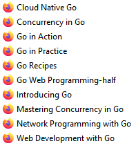

# GolangFundamentals
Golang fundamentals.


```go
package main

import "fmt"

func main(){
	f()
	g()
}

func f(){
	i := 1
	for i <= 10 {
		if i % 2 == 0 {
			fmt.Println(i, "Even")
		} else if i % 2 != 0 && i % 3 == 0 {
			fmt.Println(i, "Odd and divisible by 3")
		} else {
			fmt.Println(i, "Odd")
		}
		i = i + 1
	}
}

func g(){
	for i := 11; i <= 20; i++ {
		switch i{
		case 11: fmt.Println("Eleven")
		case 12: fmt.Println("Twelve")
		case 13: fmt.Println("Thirteen")
		default: fmt.Println(i) 
		}
	}
}

```
<hr>

```go
// go run Main.go
// go build -- creates .exe file at same loc you were when you used 'go build'
// go install

package main

import "fmt"

var (
	a = 5
	b = 10
	c = 50
)

func main(){
	const z string = "This string is constant"
	var i int = 80
	e := 20
	var t int
	t = 10000
	var my_string string = "Hello, world!"
	
	fmt.Println(i+e+t, "|==|", my_string, "||==||", z)
	f()
}

func f(){
	fmt.Print("Enter a number: ")
	var input float64
	fmt.Scanf("%f", &input)

	output := input * 2

	fmt.Println(output)
}
// 10100 |==| Hello, world! ||==|| This string is constant
// Enter a number: 3
// 6
```

<hr>

**Arrays, Slices, and Maps**
```go
// Arrays
func main(){
	x := [5]float64{ 98, 93, 77, 82, 83}
	var total float64 = 0

	for _, value := range x {
		total += value
	}
	fmt.Println(total / float64(len(x)))
	g()
}

func g(){
	my_array := [5]float64{ 1, 2, 3, 4, 5}
	var total float64 = 0

	for i := 0; i < len(my_array); i++{
		total += my_array[i]
	}
	fmt.Println(total/float64(len(my_array)))
}
```


```go
func main(){
	var x []float64 //slice
	y := make([]float64, 5) //slice
	arr := [5]float64{1, 2, 3, 4, 5} //array
	z := arr[2:5] //slice of array
	fmt.Println(x, y, z, arr)
// [] [0 0 0 0 0] [3 4 5] [1 2 3 4 5]
}
```


```go
func main(){
	slice1 := []int{1,2,3}
	slice2 := append(slice1, 4, 5)
	fmt.Println(slice1, slice2)
}
// [1 2 3] [1 2 3 4 5]

func main(){
	slice1 := []int{1,2,3}
	slice2 := make([]int, 2)
	copy(slice2, slice1)
	fmt.Println(slice1, slice2)
}
// [1 2 3] [1 2]
```
* A map is an unordered collection of key-value pairs (maps are also sometimes calledassociative arrays, hash tables, or dictionaries). Maps are used to look up a value by itsassociated key.
```go
	x := make(map[string]int)
	x["key"] = 10
	fmt.Println(x["key"])
//10
```

**Functions**

```go
func main(){
	xzx := []float64{98,93,77,82,83}
	fmt.Println(average(xzx))
}
// The average function will need to take in a slice of float64s and return one float64.
func average(xs []float64)float64{
	total := 0.0
	for _, v := range xs{
		total += v
	}
	return total/float64(len(xs))
}
```

<hr><hr>

https://gowebexamples.com/routes-using-gorilla-mux/

http://www.gorillatoolkit.org/pkg/mux

https://gobuffalo.io/en/docs/routing/

[gophercises] https://www.youtube.com/user/joncalhoun/playlists

https://duckduckgo.com/?q=installing+packages+golang&t=ffab&atb=v192-6&ia=web

https://github.com/golang/go/wiki/Books

https://github.com/jakescript/go-bible

https://github.com/dariubs/GoBooks

https://github.com/hoanhan101/ultimate-go

https://www.amazon.com.br/Writing-Interpreter-English-Thorsten-Ball-ebook/dp/B01N2T1VD2

https://lets-go.alexedwards.net/ [paid book]

https://www.usegolang.com/ [paid book]

https://github.com/quii/learn-go-with-tests

https://gobuffalo.io/en/

https://gophercises.com/




**Data Structures**

https://github.com/search?l=Go&q=data+structures&type=Repositories [github search "go data structures"]

https://github.com/PeterRK/DSGO

https://github.com/0xAX/go-algorithms

https://github.com/arnauddri/algorithms

https://github.com/floyernick/Data-Structures-and-Algorithms

https://github.com/x899/algorithms

https://www.golangprograms.com/data-structure-and-algorithms.html

https://www.youtube.com/playlist?list=PLVEltXlEeWgkZsSMaPo40PmTpVT9gLivt [Let's Learn Algorithms - Jon Calhoun]

https://www.calhoun.io/

https://ieftimov.com/post/testing-in-go-first-principles/

https://ieftimov.com/post/golang-datastructures-stacks-queues/

https://www.programming-books.io/essential/go/interfaces-4f5f2959e72c431e995527b51ad7fd8e

https://www.programming-books.io/

https://www.golang-book.com/books/intro/8

https://bogotobogo.com/GoLang/GoLang_Web.php

https://bogotobogo.com/GoLang/GoLang_Linked_List.php

https://github.com/golang/go/wiki/LearnServerProgramming

https://astaxie.gitbooks.io/build-web-application-with-golang/content/en/

https://github.com/astaxie/build-web-application-with-golang/blob/master/en/preface.md

https://github.com/dariubs/GoBooks

https://golang.org/doc/code.html

https://codegangsta.gitbooks.io/building-web-apps-with-go/content/

https://quii.gitbook.io/learn-go-with-tests/

https://github.com/hoanhan101/ultimate-go

https://github.com/search?q=go+restful [github search "go restful"]

https://github.com/golang/go/wiki/Learn [links to learning resources]

https://rustwasm.github.io/docs/book/ [Rust to WebAssembly]

https://github.com/trending/go [trending Go repos on github]

https://github.com/avelino/awesome-go [list of awesome Go frameworks, libraries and software]
